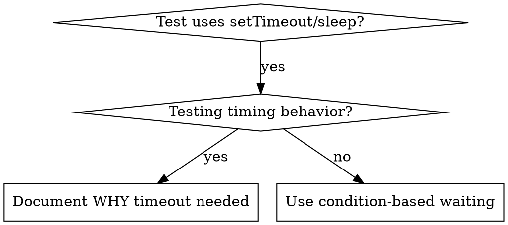

# Condition-Based Waiting

## Overview

不稳定的测试经常用随意的时间等待来猜时序。这会产生竞态：测试在快机器上过，在负载高或 CI 里挂。

**Core principle:** Wait for the actual condition you care about, not a guess about how long it takes.
（核心原则：等你真正关心的那个条件，而不是猜它要多久。）

## When to Use



**适用：**
- 测试里有随意的延迟（`setTimeout`、`sleep`、`time.sleep()`）
- 测试不稳定（有时过，负载高就挂）
- 并行执行时测试超时
- 等待异步操作完成

**不适用：**
- 测试的**目标**就是时序行为（防抖、节流间隔）
- 确实用了固定等待时，必须写清为什么

## Core Pattern

```typescript
// ❌ BEFORE: Guessing at timing
await new Promise(r => setTimeout(r, 50));
const result = getResult();
expect(result).toBeDefined();

// ✅ AFTER: Waiting for condition
await waitFor(() => getResult() !== undefined);
const result = getResult();
expect(result).toBeDefined();
```

## Quick Patterns

| Scenario | Pattern |
|----------|---------|
| Wait for event | `waitFor(() => events.find(e => e.type === 'DONE'))` |
| Wait for state | `waitFor(() => machine.state === 'ready')` |
| Wait for count | `waitFor(() => items.length >= 5)` |
| Wait for file | `waitFor(() => fs.existsSync(path))` |
| Complex condition | `waitFor(() => obj.ready && obj.value > 10)` |

## Implementation

通用轮询函数：

```typescript
async function waitFor<T>(
  condition: () => T | undefined | null | false,
  description: string,
  timeoutMs = 5000
): Promise<T> {
  const startTime = Date.now();

  while (true) {
    const result = condition();
    if (result) return result;

    if (Date.now() - startTime > timeoutMs) {
      throw new Error(`Timeout waiting for ${description} after ${timeoutMs}ms`);
    }

    await new Promise(r => setTimeout(r, 10)); // Poll every 10ms
  }
}
```

带领域专用辅助函数的完整实现（`waitForEvent`、`waitForEventCount`、`waitForEventMatch`）见 [assets/condition-based-waiting-example.ts](assets/condition-based-waiting-example.ts)，取自一次真实调试。

## Common Mistakes

**❌ Polling too fast:** `setTimeout(check, 1)` —— 白烧 CPU
**✅ Fix:** 每 10ms 轮询一次

**❌ No timeout:** 条件永远不满足就死循环
**✅ Fix:** 永远带超时，并给出清晰的错误

**❌ Stale data:** 在循环外缓存了状态
**✅ Fix:** 在循环内部调 getter，拿最新数据

## When Arbitrary Timeout IS Correct

```typescript
// Tool ticks every 100ms - need 2 ticks to verify partial output
await waitForEvent(manager, 'TOOL_STARTED'); // First: wait for condition
await new Promise(r => setTimeout(r, 200));   // Then: wait for timed behavior
// 200ms = 2 ticks at 100ms intervals - documented and justified
```

**要求：**
1. 先等触发条件
2. 基于已知的时序（不是猜的）
3. 写注释说明**为什么**

## Real-World Impact

来自一次真实调试（2025-10-03）：

- 修好 3 个文件里的 15 个不稳定测试
- 通过率：60% → 100%
- 执行时间：快了 40%
- 不再有竞态
