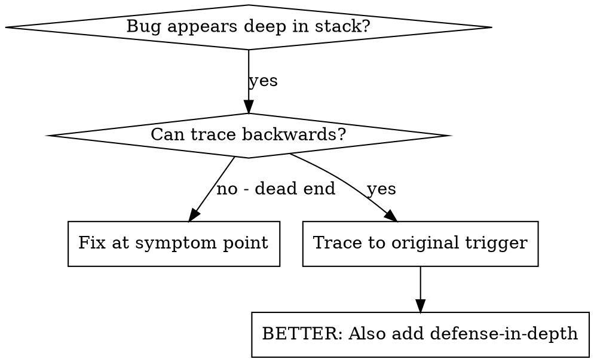
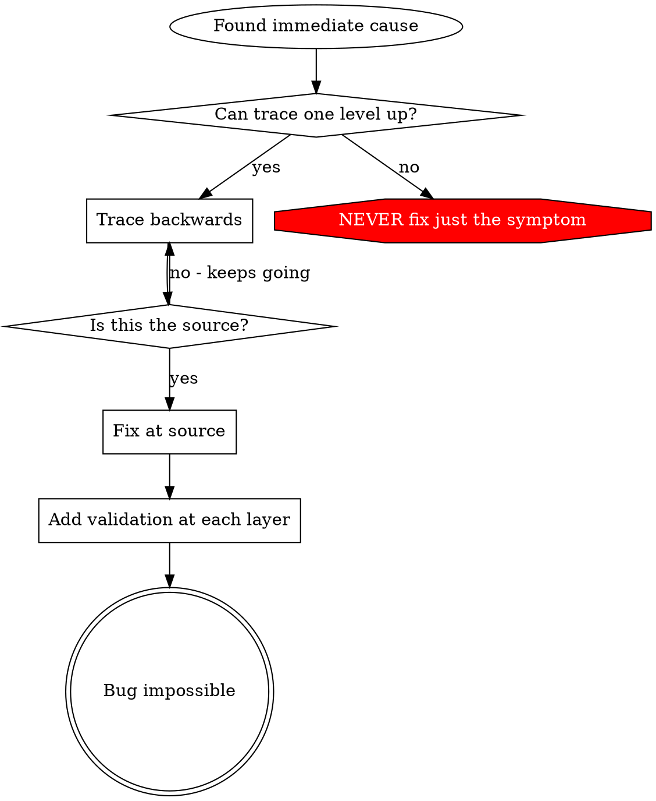

# Root Cause Tracing

## Overview

bug 常常在调用栈深处才现形（在错误的目录里跑了初始化命令、文件建到了错误位置、数据库用错误的路径打开）。你的直觉是就地修报错的地方，但那是在治症状。

**Core principle:** Trace backward through the call chain until you find the original trigger, then fix at the source.
（核心原则：沿调用链往回追，直到找到最初的触发点，然后在源头修。）

## When to Use



**适用：**
- 错误发生在执行深处（不在入口处）
- 堆栈显示很长的调用链
- 说不清非法数据是从哪来的
- 需要找出是哪个测试/哪段代码触发了问题

## The Tracing Process

### 1. Observe the Symptom

```
Error: git init failed in ~/project/packages/core
```

### 2. Find Immediate Cause

**哪段代码直接导致了这个？**

```typescript
await execFileAsync('git', ['init'], { cwd: projectDir });
```

### 3. Ask: What Called This?

```typescript
WorktreeManager.createSessionWorktree(projectDir, sessionId)
  → called by Session.initializeWorkspace()
  → called by Session.create()
  → called by test at Project.create()
```

### 4. Keep Tracing Up

**传进来的是什么值？**
- `projectDir = ''`（空字符串！）
- 空字符串作为 `cwd` 会解析成 `process.cwd()`
- 那就是源码目录！

### 5. Find Original Trigger

**空字符串是从哪来的？**

```typescript
const context = setupCoreTest(); // Returns { tempDir: '' }
Project.create('name', context.tempDir); // Accessed before beforeEach!
```

## Adding Stack Traces

手工追不动时，加埋点：

```typescript
// Before the problematic operation
async function gitInit(directory: string) {
  const stack = new Error().stack;
  console.error('DEBUG git init:', {
    directory,
    cwd: process.cwd(),
    nodeEnv: process.env.NODE_ENV,
    stack,
  });

  await execFileAsync('git', ['init'], { cwd: directory });
}
```

**关键：** 测试里用 `console.error()`（不要用 logger——可能被吞掉）

**跑起来并捕获：**

```bash
npm test 2>&1 | grep 'DEBUG git init'
```

**分析堆栈：**
- 找测试文件名
- 找到触发调用的行号
- 找出规律（同一个测试？同一个参数？）

## Finding Which Test Causes Pollution

如果测试过程中出现了不该有的文件/状态，但不知道是哪个测试干的：

用二分脚本 [scripts/find-polluter.sh](scripts/find-polluter.sh)：

```bash
./find-polluter.sh '.git' 'src/**/*.test.ts'
```

它会逐个跑测试，在第一个污染源处停下。用法见脚本头部注释。

## Real Example: Empty projectDir

**症状：** `.git` 被建在了 `packages/core/`（源码目录）

**追溯链：**
1. `git init` 在 `process.cwd()` 里执行 ← cwd 参数是空的
2. WorktreeManager 被传入空 projectDir
3. Session.create() 传了空字符串
4. 测试在 beforeEach 之前就访问了 `context.tempDir`
5. setupCoreTest() 初始返回 `{ tempDir: '' }`

**根因：** 顶层变量初始化时访问了还没赋值的空值

**修复：** 把 tempDir 改成 getter，在 beforeEach 之前访问就抛错

**同时加了纵深防御：**
- 第 1 层：Project.create() 校验目录
- 第 2 层：WorkspaceManager 校验非空
- 第 3 层：环境守卫，拒绝在临时目录之外执行 git init
- 第 4 层：git init 之前打印堆栈日志

## Key Principle



**NEVER fix just where the error appears.** 往上追，找到最初的触发点。

## Stack Trace Tips

- **测试里：** 用 `console.error()`，不要用 logger——logger 可能被静默
- **位置：** 在危险操作**之前**打日志，不要等它失败之后
- **带上上下文：** 目录、cwd、环境变量、时间戳
- **抓堆栈：** `new Error().stack` 会给出完整调用链

## Real-World Impact

来自一次真实调试（2025-10-03）：

- 通过 5 层追溯找到根因
- 在源头修复（getter 校验）
- 补了 4 层防御
- 1847 个测试全过，零污染
