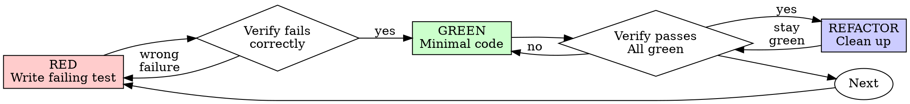

# Test-Driven Development (TDD)

## Overview

先写测试，看它失败，再写最少代码让它通过。

**Core principle:** If you didn't watch the test fail, you don't know if it tests the right thing.
（核心原则：没有亲眼看到测试失败，你就不知道它测的是不是正确的东西。）

**Violating the letter of the rules is violating the spirit of the rules.**
（违反规则的字面要求，就是在违反规则的精神。）

## When to Use

**Always:**
- 新功能
- Bug 修复
- 重构
- 行为变更

**Exceptions (ask your human partner):**
- 一次性丢弃的原型
- 生成的代码
- 配置文件

心里冒出"这次就先跳过 TDD 吧"？停下。那是合理化借口。

## The Iron Law

```
NO PRODUCTION CODE WITHOUT A FAILING TEST FIRST
```

先写了代码再补测试？删掉。从头来。

**No exceptions:**
- Don't keep it as "reference"
- Don't "adapt" it while writing tests
- Don't look at it
- Delete means delete

从测试出发重新实现。就这样。

## Red-Green-Refactor



### RED - Write Failing Test

只写一个最小的测试，说明应该发生什么。

<Good>
```typescript
test('retries failed operations 3 times', async () => {
  let attempts = 0;
  const operation = () => {
    attempts++;
    if (attempts < 3) throw new Error('fail');
    return 'success';
  };

  const result = await retryOperation(operation);

  expect(result).toBe('success');
  expect(attempts).toBe(3);
});
```
名字清晰、测真实行为、只测一件事
</Good>

<Bad>
```typescript
test('retry works', async () => {
  const mock = jest.fn()
    .mockRejectedValueOnce(new Error())
    .mockRejectedValueOnce(new Error())
    .mockResolvedValueOnce('success');
  await retryOperation(mock);
  expect(mock).toHaveBeenCalledTimes(3);
});
```
名字含糊、测的是 mock 不是代码
</Bad>

**Requirements:**
- 一件事
- 清晰的名字
- 真实代码（除非实在无法避免才用 mock）

### Verify RED - Watch It Fail

**MANDATORY. Never skip.（强制执行，永不跳过。）**

```bash
npm test path/to/test.test.ts
```

确认：
- 测试失败（不是报错崩掉）
- 失败信息符合预期
- 失败原因是功能缺失（不是拼写错误）

**测试直接通过了？** 那你测的是已有行为。改测试。

**测试报错了？** 修报错，重跑到它以正确方式失败为止。

### GREEN - Minimal Code

写最简单的代码让测试通过。

<Good>
```typescript
async function retryOperation<T>(fn: () => Promise<T>): Promise<T> {
  for (let i = 0; i < 3; i++) {
    try {
      return await fn();
    } catch (e) {
      if (i === 2) throw e;
    }
  }
  throw new Error('unreachable');
}
```
刚好能让测试通过
</Good>

<Bad>
```typescript
async function retryOperation<T>(
  fn: () => Promise<T>,
  options?: {
    maxRetries?: number;
    backoff?: 'linear' | 'exponential';
    onRetry?: (attempt: number) => void;
  }
): Promise<T> {
  // YAGNI
}
```
过度设计
</Bad>

不要加功能、不要顺手重构别的代码、不要做测试之外的"改进"。

### Verify GREEN - Watch It Pass

**MANDATORY.**

```bash
npm test path/to/test.test.ts
```

确认：
- 测试通过
- 其他测试仍然通过
- 输出干净（无 error、无 warning）

**测试没过？** 改代码，不改测试。

**其他测试挂了？** 立刻修。

### REFACTOR - Clean Up

只在绿灯之后：
- 去重
- 改好名字
- 抽取辅助函数

保持测试绿灯。不要加行为。

### Repeat

为下一个功能写下一个失败测试。

## Good Tests

| Quality | Good | Bad |
|---------|------|-----|
| **Minimal** | One thing. "and" in name? Split it. | `test('validates email and domain and whitespace')` |
| **Clear** | Name describes behavior | `test('test1')` |
| **Shows intent** | Demonstrates desired API | Obscures what code should do |

写或改任何测试时，读 [references/writing-good-tests.md](references/writing-good-tests.md)，它给出让测试保持诚实的规则：

- 写测试体之前，先说出"哪个生产代码改动会让这个测试失败"
- 断言真实行为，绝不断言 mock 行为
- 只给测试用的代码放测试工具里，不要混进生产类
- mock 一个依赖之前，先搞清它的副作用

## Common Rationalizations

| Excuse | Reality |
|--------|---------|
| "Too simple to test" | Simple code breaks. Test takes 30 seconds. |
| "I'll test after" | Tests written after pass immediately — which proves nothing. They may test the wrong thing, test the implementation instead of the behavior, or miss the edge case you forgot. You never watched it fail, so you never proved it can catch the bug. Test-first forces that failure. |
| "Tests after achieve same goals (spirit not ritual)" | Tests-after answer "what does this do?"; tests-first answer "what should this do?" Tests written after are biased by the code you already wrote — you verify the cases you remembered, not the ones you'd have discovered. Coverage without proof the tests work. |
| "Already manually tested" | Manual testing is ad-hoc: no record of what you covered, no way to re-run it when the code changes, easy to forget cases under pressure. "Worked when I tried it" ≠ comprehensive. Automated tests run the same way every time. |
| "Deleting X hours is wasteful" | Sunk cost fallacy — that time is already spent either way. The real choice: rewrite with TDD (high confidence) vs. keep it and bolt tests on after (low confidence, likely bugs). Keeping code you can't trust is the waste. |
| "Keep as reference, write tests first" | You'll adapt it. That's testing after. Delete means delete. |
| "Need to explore first" | Fine. Throw away exploration, start with TDD. |
| "Test hard = design unclear" | Listen to test. Hard to test = hard to use. |
| "TDD will slow me down" | TDD IS the pragmatic path: catches bugs before commit, prevents regressions, lets you refactor without fear. "Pragmatic" shortcuts mean debugging in production — slower, not faster. |
| "Manual test faster" | Manual doesn't prove edge cases. You'll re-test every change. |
| "Existing code has no tests" | You're improving it. Add tests for existing code. |

> 上表的中文要点：简单代码也会坏，写测试只要 30 秒；补写的测试一写就过，什么也证明不了；手工测试不可复现、覆盖不全；已花掉的时间是沉没成本，真正的选择题是"用 TDD 重写"还是"留下不可信代码"；保留代码当"参考"最后一定会变成照着改；"先探索"可以，但探索产物要丢掉；测试难写说明接口难用；TDD 才是省时间的路。

## Red Flags - STOP and Start Over

- Code before test
- Test after implementation
- Test passes immediately
- Can't explain why test failed
- Tests added "later"
- Rationalizing "just this once"
- "I already manually tested it"
- "Tests after achieve the same purpose"
- "It's about spirit not ritual"
- "Keep as reference" or "adapt existing code"
- "Already spent X hours, deleting is wasteful"
- "TDD is dogmatic, I'm being pragmatic"
- "This is different because..."

**All of these mean: Delete code. Start over with TDD.**

> 以上任何一条出现，含义都是：删代码，用 TDD 重来。

## Example: Bug Fix

**Bug:** 空邮箱被接受了

**RED**
```typescript
test('rejects empty email', async () => {
  const result = await submitForm({ email: '' });
  expect(result.error).toBe('Email required');
});
```

**Verify RED**
```bash
$ npm test
FAIL: expected 'Email required', got undefined
```

**GREEN**
```typescript
function submitForm(data: FormData) {
  if (!data.email?.trim()) {
    return { error: 'Email required' };
  }
  // ...
}
```

**Verify GREEN**
```bash
$ npm test
PASS
```

**REFACTOR**
需要时把校验抽出来支持多字段。

## Verification Checklist

声称完成之前：

- [ ] 每个新函数/方法都有测试
- [ ] 实现之前亲眼看过每个测试失败
- [ ] 每个测试因预期原因失败（功能缺失，不是拼写错误）
- [ ] 每个测试只写了让它通过的最少代码
- [ ] 所有测试通过
- [ ] 输出干净（无 error、无 warning）
- [ ] 测试用真实代码（mock 只在无法避免时使用）
- [ ] 边界情况与错误路径已覆盖

有任何一项打不了勾？你跳过了 TDD。重来。

## When Stuck

| Problem | Solution |
|---------|----------|
| Don't know how to test | Write wished-for API. Write assertion first. Ask your human partner. |
| Test too complicated | Design too complicated. Simplify interface. |
| Must mock everything | Code too coupled. Use dependency injection. |
| Test setup huge | Extract helpers. Still complex? Simplify design. |

> 不知道怎么测 → 先写出你希望的 API 和断言，再问用户；测试太复杂 → 是设计太复杂，简化接口；什么都要 mock → 耦合太重，用依赖注入；测试准备代码太长 → 抽辅助函数，还是复杂就简化设计。

## Debugging Integration

发现 bug？写一个能复现它的失败测试。走 TDD 循环。这个测试同时证明了修复有效，并防止回归。

**Never fix bugs without a test.（没有测试就不修 bug。）**

## Final Rule

```
Production code → test exists and failed first
Otherwise → not TDD
```

没有用户许可，不存在例外。

## 与其他 skill 的关系

| 情境 | 转入 |
|---|---|
| 出现 bug、测试失败、行为异常，还不知道根因 | `systematic-debugging`——先找根因；定位后回到本 skill 写复现测试再修 |
| 功能写完、准备声称完成 | `verification-before-completion`——本 skill 的 Verification Checklist 是它的输入之一，不是替代品 |
| 测试本身难写、mock 铺开、想简化实现 | `ponytail`——测试难写多半是设计过度 |
| 测试代码要不要评审 | `ponytail-review` |
| TDD 过程中改了既有实现 | 转 `verification-before-completion` 前先跑全量测试，确认无回归 |

**本 skill 管"怎么写实现"；根因不明时不要在本 skill 里硬猜——先转 `systematic-debugging`。**
